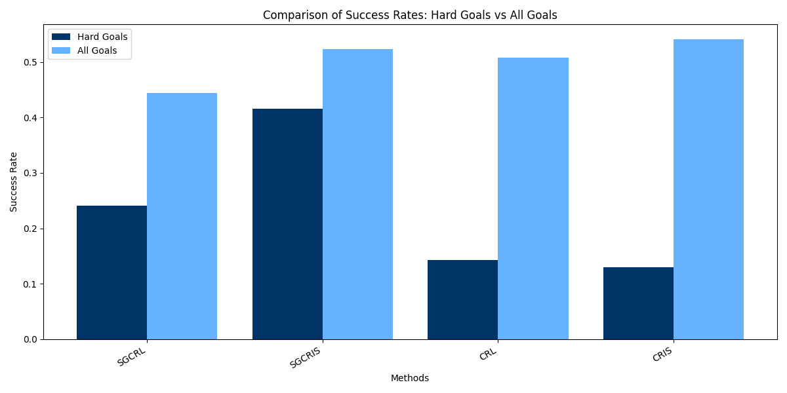

# Single Goal Contrastive Learning for Goal-Conditioned RL

[](https://www.python.org/downloads/)
[](https://opensource.org/licenses/MIT)

This repository contains the official implementation for my Bachelor's Thesis at **Ulm University (March 2025)**.

The project builds upon **Stable Contrastive RL** ([Eysenbach et al., 2024](https://arxiv.org/abs/2408.05804)). While the original work uses JAX, this implementation provides a stable, accessible version of Contrastive RL (CRL) as a baseline for the **Single Goal Contrastive RL with Imagined Subgoals (SGCRIS)** extension.

For a deep dive into the mathematical foundations and experimental setup, please refer to [thesis.pdf](thesis.pdf).

---

## 📖 Abstract

Sparse reward problems and goal-conditioned reinforcement learning have motivated the use of contrastive learning as a viable solution [19]. Prior work in contrastive reinforcement learning (CRL) has demonstrated that single goal data collection significantly affects the performance [3]. However, whether this improvement stems from better representation quality remains an open question. This study explores whether enhancing single goal aspiration through imagined subgoals [9] can accelerate representation learning and ultimately improve overall performance. This paper proposes Single Goal Contrastive RL with Imagined Subgoals (SGCRIS), a novel extension of CRL that integrates subgoal selection using latent representations to ensure reachability and feasibility. The results demonstrate that SGCRIS enables faster skill acquisition, outperforming standard single goal contrastive RL in both task-specific and general goal evaluations. Additionally, this study examines whether incorporating negative mining into this approach can yield improvements.

---

## 📈 Results

### SGCRIS vs. Prior Methods



In contrast to CRIS, SGCRIS outperformed all other methods, as shown in the Figure, with the exception of the all-goals category, where CRIS was 4.639% better. This difference may not be statistically significant if more training data are available. SGCRIS outperformed SGCRL by 72.388% in the hard goal tests and by 17.775% when evaluated for all goals. Compared with CRL, SGCRIS performed 190.424% better on hard goals and slightly better by 3.015% for all goals.

This study concludes that integrating imagined subgoals into single goal contrastive RL (SGCRIS) is a promising extension of contrastive RL, enabling the agent to acquire skills more effectively and generalize better than SGCRL. Although SGCRIS outperforms SGCRL in skill acquisition, it shows high volatility and aggressiveness; therefore, stabilization techniques are necessary to improve reliability and consistency.

---

## 💻 Repository Structure

- **`agents/`**: Contains the core RL logic. `stable_crl.py` is the baseline, while `sgcris.py` implements the subgoal extension.
- **`core/`**: Management of replay buffers (`buffers.py`), metrics calculation, and data persistence.
- **`utils/`**: General utilities including custom logging and monitoring.
- **`train_fetch.py`**: The primary entry point for starting training runs.
- **`thesis.pdf`**: The full Bachelor's Thesis document for theoretical reference.

---

## 🚀 Getting Started

### 1. Installation

Install the necessary dependencies using pip:

```bash
pip install -r requirements.txt
```

### 2. Running Experiments

```bash
python train_fetch.py \
    --env_name='FetchPickAndPlace-v2' \
    --exp_name='SGCRIS_fetch' \
    --use_subgoals=True \
    --use_single_goal=True \
    --start_timesteps=10000 \
    --max_episodes=30000
```

### 3. Key Arguments

| Flag              |        Default         |                         Description                         |
| :---------------- | :--------------------: | :---------------------------------------------------------: |
| --env_name        | "FetchPickAndPlace-v2" |            Setting the enviroment for training.             |
| --start_timesteps |         10000          |  Random off-policy data-collection before learning begins.  |
| --max_episodes    |         30000          |                 Maximum number of episodes.                 |
| --use_subgoals    |          True          |           Activates subgoals for contrastive RL.            |
| --use_single_goal |          True          |     Activates using one single hard goals for training.     |
| --load_model      |          True          | Loads pretrained-model for the with the name of "exp_name". |

## References and Acknowledgements

- Thesis: Marius David Fauser, "Single Goal Contrastive Learning for Goal-Conditioned Reinforcement Learning," Ulm University, 2025.
- Base Paper: Eysenbach et al. (2024), "A Single Goal is All You Need."

## ⚠️ Note on Implementation & Reproducibility

The code in this repository represents a **stable, standalone version** of the project. Please note:

- **Feature Set:** This version focus on the core SGCRIS logic. Some experimental features used in the final thesis (specifically [Mention 1-2 features if you remember them]) were part of a high-performance version hosted on university infrastructure and are not included here.
- **Loss Functions:** The loss implementations here are simplified for clarity and local execution.
- **Hardware:** The results in the `thesis.pdf` were generated using a high-performance computing cluster. Running this specific code locally will demonstrate the logic but may yield different convergence patterns due to these versioning differences.
